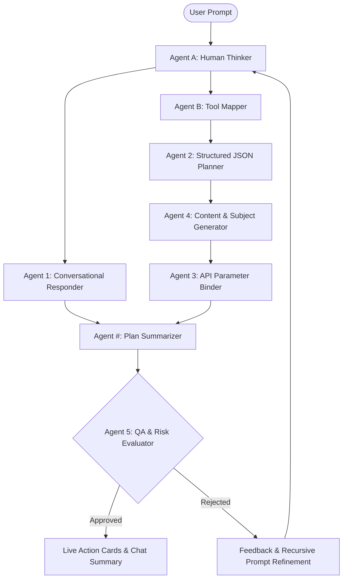

# WokAI OS: The Agentic Productivity Operating System

WokAI OS is a futuristic, command-center productivity operating system powered by a coordinated multi-agent orchestration architecture. It goes beyond the limits of standard chatbots: WokAI constructs logical step-by-step plans, writes files, schedules meetings, checks emails, executes host shell commands, places outbound phone calls, and controls active browser instances through automated scripts—all while keeping sensitive operations behind user approval gates.

---

## 🚀 The Core Architecture: 5-Agent + Agent # Orchestration

WokAI OS implements a structured, sequential **OMP-inspired Multi-Agent Conductor** pipeline. Instead of relying on a single prompt-response loop, WokAI distributes cognitive load across specialized agents to guarantee correctness, safety, and thoroughness:



### 1. **Agent A (Human Worker Thinker)**
*   **Role**: Cognitive deconstruction of user intent.
*   **Prompting Focus**: It ignores tool constraints and models the step-by-step actions a highly proactive, competent human assistant would take to complete the request.

### 2. **Agent B (Tool Mapper & Adaptor)**
*   **Role**: System API capability matching.
*   **Prompting Focus**: Maps Agent A's human steps to WokAI's registered list of allowed system tools (e.g. `gmail.send`, `calendar.createEvent`, `devices.terminal`). If no direct match exists, it adapts the step using fallback mechanisms (like browser plans or terminal operations).

### 3. **Agent 1 (Worthful Conversational Responder)**
*   **Role**: User-facing conversational engine.
*   **Prompting Focus**: Drafts a natural, professional reply explaining the upcoming steps to the user in 2-3 sentences, free from technical JSON formats or backend tool names.

### 4. **Agent 2 (Structured Plan Generator)**
*   **Role**: JSON Plan Synthesizer.
*   **Prompting Focus**: Translates Agent B's mapped tools into a structured JSON block containing exact `WokaiAction` objects, assigns unique IDs, evaluates risk level (`LOW`, `MEDIUM`, `HIGH`, `CRITICAL`), and classifies sensitive actions requiring approval.

### 5. **Agent 4 (Content Generator)**
*   **Role**: Contextual payload writer.
*   **Prompting Focus**: Dynamically writes exact code, script bodies, markdown docs, search query terms, email subjects/bodies, or terminal command lines needed for each scheduled action.

### 6. **Agent 3 (API Handler)**
*   **Role**: API Parameter Binder.
*   **Prompting Focus**: Merges structured actions from Agent 2 with payload contents from Agent 4, outputting fully hydrated, syntactically valid execution parameters.

### 7. **Agent # (Plan Summarizer)**
*   **Role**: Execution Summary Engine.
*   **Prompting Focus**: Looks at Agent 1's conversational response and the compiled API action list, generating a concise, high-level summary of what will run. 
*   *Note*: When actions execute, Agent # is invoked again via `/api/agent/summarize` to convert raw JSON outputs (like a raw email list or JSON calendar array) into readable summaries.

### 8. **Agent 5 (Quality Assurance & Evaluator)**
*   **Role**: Gatekeeper & Auditor.
*   **Prompting Focus**: Evaluates the plan against the original prompt. If any actions are irrelevant, unsafe, or missing, it rejects the plan, creates structured feedback, and triggers a recursive conductor pass with a refined prompt to fix the plan.

---

## 🛠️ API Integrations & Native Execution Details

WokAI OS connects to local and cloud services to execute actions.

### 1. **Google Workspace APIs**
WokAI uses OAuth 2.0 authorization with Google Cloud APIs:
*   **Gmail API (`gmail.send`, `gmail.search`, `gmail.summarize`)**: Reads threads, searches messages with structured query strings, drafts and sends emails.
*   **Google Calendar API (`calendar.createEvent`, `calendar.listEvents`)**: Creates scheduled meetings with descriptions/agendas, lists calendars, and removes cancelled events.
*   **Google Drive API (`drive.search`)**: Performs searches against files using user queries, returning names, IDs, mimeTypes, modified times, and direct `webViewLink` references.
*   **Google Docs, Sheets, & Slides APIs (`docs.create`, `sheets.createTracker`, `slides.createDeck`)**: Generates documents with structured layouts and templates.

### 2. **Local Companion Daemon (Host Execution)**
For local operation, WokAI communicates with the **WokAI Companion Service** running on port `4317`:
*   **Terminal Execution (`devices.terminal`)**: Executes native host commands (Command Prompt/PowerShell) with 15-second safety timeout controllers.
*   **Application Launcher (`devices.openApp`)**: Spawns native processes on the local machine.
*   **Online/Offline Command Queueing**: Queues commands for execution when offline and syncs them back to Firestore.

### 3. **Playwright Browser Agent (`browser.plan`)**
*   **Workflow**: Executes dynamic web automation using a headless/headed Chromium instance (configured via Playwright to bypass automation detection).
*   **Safety Guard**: Pauses browser execution and requests user approval before clicking final forms submit buttons or conducting uploads.

### 4. **Twilio Outbound Calling (`calls.prepare`)**
*   **Workflow**: Prepares outbound phone call script bodies. If Twilio environment variables are active, it initiates voice calls using Twilio's REST API.

---

## 💎 Premium UI/UX Highlights

*   **Real-time Conductor Log**: Displays a live, sequential step-by-step progress trace showing which agent is thinking and which has completed (`✓ Done`). This gives users instant visual feedback on processing latency.
*   **Unified Command Center**: Dashboard cards displaying pending actions, active user tasks, personalized memories, email status, and device connections.
*   **Action Output Toggle**: Every execution card displays Agent #'s friendly result summary by default, with an expandable "Show Raw API Output" toggle rendering the raw JSON API output side-by-side.
*   **Approval Gates**: All actions marked as sensitive are paused until the user clicks "Approve".

---

## ⚙️ Setup & Installation

### Local Web Server Setup:
1. Install dependencies:
   ```bash
   npm install --cache .npm-cache
   ```
2. Configure Environment:
   ```bash
   cp .env.example .env.local
   # Fill in GEMINI_API_KEY, Google OAuth keys, Firebase credentials, and optional Twilio API keys.
   ```
3. Run Development Server:
   ```bash
   npm run dev
   ```

### Local Companion Setup:
To run terminal commands and browser automations locally, start the companion node server:
```bash
node wokai-companion.js
```
The Next.js client automatically detects the companion on port `4317` and routes local actions there.

### Verify Build Quality:
Ensure type safety and linting compliance before shipping:
```bash
npm run verify
```

---

## 📦 Tech Stack
*   **Frontend**: Next.js (App Router), TypeScript, Tailwind CSS, Shadcn/ui elements, Lucide Icons, Framer Motion.
*   **Backend**: Next.js Route Handlers (SSE streaming), Express (Companion Service), Playwright (Browser Automation), Google APIs, Twilio.
*   **Database & Auth**: Google Firebase Auth, Cloud Firestore database rules.
